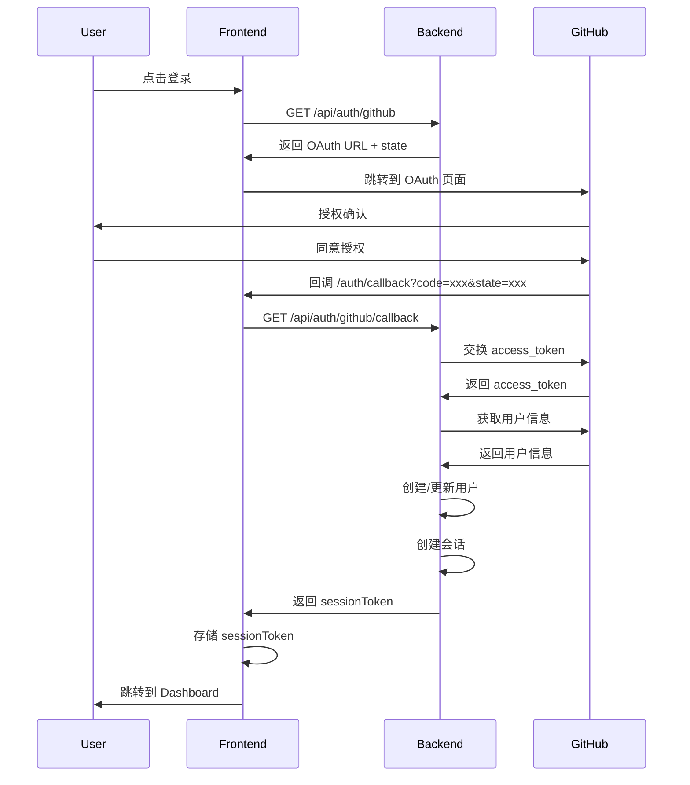
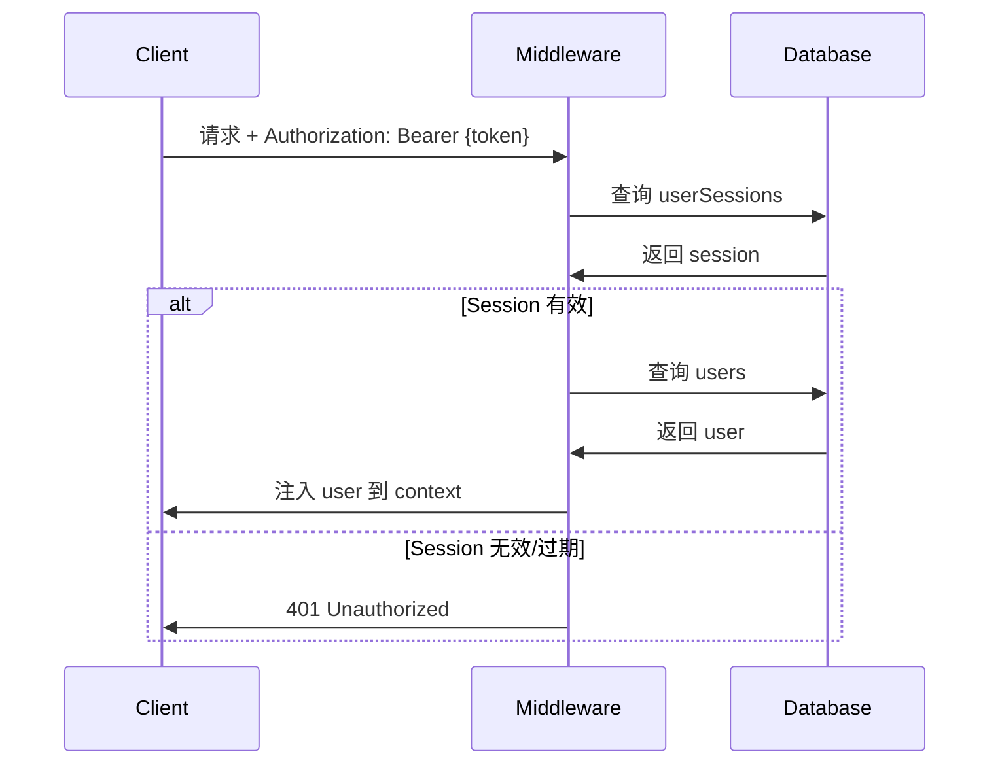

# NekroEndpoint 实现状态报告

**生成时间**: 2025-12-04  
**项目版本**: 1.1.0  
**完成度**: Phase 1 (100%) + Phase 2 (100%) + Phase 3.1 (100%)  
**最后更新**: Phase 3.1 动态代理端点实现完成

---

## 📊 总体完成度

| 模块          | 完成度                           | 状态      |
| ------------- | -------------------------------- | --------- |
| 数据库 Schema | 85% (6/7 核心表)                 | ✅ 可用   |
| 认证系统      | 100%                             | ✅ 完整   |
| 端点管理      | 100% (static/proxy/dynamicProxy) | ✅ 完整   |
| 权限组系统    | 100%                             | ✅ 完整   |
| 管理员功能    | 100%                             | ✅ 完整   |
| 初始化系统    | 100%                             | ✅ 完整   |
| 前端界面      | 100%                             | ✅ 完整   |
| 访问日志      | 0%                               | ❌ 未实现 |
| 脚本端点      | 0%                               | ❌ 未实现 |

**总体评估**: ✅ **可投入生产使用**（静态内容、固定代理、动态子路径代理场景）

**Phase 3.1 新增功能**（2025-12-04）：

- ✅ **dynamicProxy 端点类型**：支持子路径完整转发
- ✅ **SSRF 防护**：阻止内网地址访问，防止服务器端请求伪造
- ✅ **路径遍历防护**：清理 `..` 等危险路径符号
- ✅ **路径白名单**：可选的访问路径限制，支持通配符
- ✅ **树结构约束**：dynamicProxy 强制为叶子节点
- ✅ **前端编辑器**：DynamicProxyEndpointEditor 可视化配置界面

---

## 🗄️ 数据库实现详情

### ✅ 已实现的表（6/7）

#### 1. users（用户表）- 100% ✅

**字段清单**:

```typescript
{
  id: string (cuid2)
  githubId: string (unique)
  username: string
  email: string | null
  avatarUrl: string | null
  apiKey: string (unique, 格式: sec-{64位十六进制})
  role: "user" | "admin"
  isActivated: boolean
  platformApiKey: string | null (PBKDF2 哈希)
  platformApiKeyCreatedAt: Date | null
  lastLoginAt: Date | null
  createdAt: Date
  updatedAt: Date
}
```

**索引**:

- `users_github_id_idx` on githubId
- `users_api_key_idx` on apiKey
- `users_platform_api_key_idx` on platformApiKey

**实现差异**:

- ✅ 新增 `githubId` 字段（设计文档未明确）
- ✅ apiKey 格式为 `sec-` 前缀（设计文档为 `ak-`）

---

#### 2. userSessions（会话表）- 100% ✅

**字段清单**:

```typescript
{
  id: string (cuid2)
  userId: string (references users.id, cascade)
  sessionToken: string (unique, cuid2)
  expiresAt: Date (30天有效期)
  createdAt: Date
}
```

**索引**:

- `user_sessions_session_token_idx` on sessionToken
- `user_sessions_user_id_idx` on userId

**实现说明**:

- 替代原设计的 OAuth Session 表
- 不存储 GitHub access_token
- 会话过期后需重新 OAuth 登录

---

#### 3. endpoints（端点表）- 100% ✅

**字段清单**:

```typescript
{
  id: string (cuid2)
  ownerUserId: string (references users.id, cascade)
  parentId: string | null (树形结构)
  path: string (端点路径)
  name: string (显示名称)
  type: "static" | "proxy" | "dynamicProxy" | "script"
  config: string (JSON)
  accessControl: "public" | "authenticated"
  requiredPermissionGroups: string | null (JSON array)
  enabled: boolean
  isPublished: boolean
  sortOrder: number
  createdAt: Date
  updatedAt: Date
}
```

**Phase 3.1 更新**:

- ✅ 新增 `dynamicProxy` 端点类型
- ✅ dynamicProxy 端点强制为叶子节点（无子节点）
- ✅ 后端 API 验证树结构约束

**索引**:

- `endpoint_owner_idx` on ownerUserId
- `endpoint_parent_idx` on parentId
- `endpoint_owner_path_idx` unique on (ownerUserId, path)

**Config 结构**:

**静态端点**:

```typescript
{
  content: string
  contentType: string (默认 "text/plain")
  headers: Record<string, string>
}
```

**代理端点（proxy）**:

```typescript
{
  targetUrl: string
  headers: Record<string, string>
  removeHeaders: string[]
  timeout: number (默认 10000ms)
}
```

**动态代理端点（dynamicProxy）** - Phase 3.1 新增:

```typescript
{
  baseUrl: string              // 基础 URL（可包含路径，如 https://raw.githubusercontent.com/user/repo/main/）
  autoAppendSlash: boolean     // 自动在 baseUrl 末尾补充斜杠（默认 true）
  headers: Record<string, string>
  removeHeaders: string[]
  timeout: number              // 默认 15000ms
  allowedPaths: string[]       // 路径白名单（支持通配符 *）
}
```

**转发行为**：

- 自动移除端点路径前缀，仅转发子路径部分
- 支持前缀匹配（访问 `/na/file.txt` 可以匹配端点 `/na`）
- 最长路径匹配优先

**用户体验增强**：

- ✅ 交互式路径预览：实时显示转发结果
- ✅ 自动补充斜杠配置：灵活控制 URL 拼接行为

**脚本端点**（未实现）:

```typescript
{
  script_content: string
  timeout_ms: number
  allowed_domains: string[]
}
```

---

#### 4. permissionGroups（权限组表）- 100% ✅

**字段清单**:

```typescript
{
  id: string (cuid2)
  ownerUserId: string (references users.id, cascade)
  name: string
  description: string | null
  createdAt: Date
  updatedAt: Date
}
```

**索引**:

- `perm_group_owner_idx` on ownerUserId

---

#### 5. accessKeys（访问密钥表）- 100% ✅

**字段清单**:

```typescript
{
  id: string (cuid2)
  permissionGroupId: string (references permissionGroups.id, cascade)
  keyValue: string (unique, 格式: ep-{32位十六进制})
  description: string | null
  expiresAt: Date | null (null 表示永久)
  isActive: boolean
  lastUsedAt: Date | null
  usageCount: number
  createdAt: Date
}
```

**索引**:

- `access_key_group_idx` on permissionGroupId

**⚠️ 关键差异**:

- **设计文档**: keyValue 应使用 PBKDF2 哈希存储
- **实际实现**: keyValue **明文存储**
- **验证方式**: 直接字符串比较（`accessKey === key.keyValue`）
- **位置**: `src/routes/execution.ts:102`
- **原因**: 简化验证逻辑，避免哈希计算开销
- **影响**: 降低安全性，但适合非敏感场景

---

#### 6. features（功能开关表）- 100% ✅

**字段清单**:

```typescript
{
  id: number (primary key)
  key: string (unique)
  name: string
  description: string
  enabled: boolean
}
```

**说明**: 模板遗留功能，非设计文档要求

---

### ❌ 未实现的表（1/7）

#### accessLogs（访问日志表）- 0% ❌

**原设计**:

```typescript
{
  id: string
  endpointId: string
  accessKeyId: string | null
  timestamp: Date
  status: number (HTTP 状态码)
  method: string
  ipAddress: string | null
  country: string | null
  userAgent: string | null
  responseTimeMs: number | null
}
```

**影响**:

- ❌ 无法记录端点访问历史
- ❌ 无法提供访问统计和分析
- ❌ 无法监控异常访问
- ❌ 无法生成流量报告

---

## 🔐 认证与安全实现

### 密钥类型与存储策略

| 密钥类型            | 格式            | 存储方式    | 用途     | 安全性 |
| ------------------- | --------------- | ----------- | -------- | ------ |
| Session Token       | cuid2           | 明文        | 会话认证 | 中等   |
| Platform API Key    | `sec-{64位hex}` | PBKDF2 哈希 | 平台管理 | 高     |
| Endpoint Access Key | `ep-{32位hex}`  | ⚠️ 明文     | 端点访问 | 低     |

### 认证流程

#### GitHub OAuth 登录流程



#### API 认证流程



### 环境变量配置

**必需变量**:

```bash
# GitHub OAuth
GITHUB_CLIENT_ID=your_client_id
GITHUB_CLIENT_SECRET=your_client_secret

# 应用配置
APP_BASE_URL=http://localhost:8787
NODE_ENV=development

# 可选配置
VITE_PORT=5173
```

**配置位置**:

- 本地开发: `.dev.vars` (已加入 .gitignore)
- 生产环境: Cloudflare Dashboard 或 `wrangler.jsonc`

---

## 🌐 API 实现详情

### ✅ 已完整实现的 API 模块

#### 1. 认证系统（/api/auth/\*）- 100% ✅

| 端点                        | 方法 | 功能             | 状态 |
| --------------------------- | ---- | ---------------- | ---- |
| `/api/auth/github`          | GET  | 获取 OAuth URL   | ✅   |
| `/api/auth/github/callback` | GET  | OAuth 回调处理   | ✅   |
| `/api/auth/me`              | GET  | 获取当前用户信息 | ✅   |
| `/api/auth/logout`          | POST | 用户登出         | ✅   |
| `/api/auth/regenerate-key`  | POST | 重新生成 API Key | ✅   |

---

#### 2. 端点管理（/api/endpoints/\*）- 95% ✅

| 端点                           | 方法   | 功能                  | 状态 |
| ------------------------------ | ------ | --------------------- | ---- |
| `/api/endpoints`               | GET    | 列出端点（树形/扁平） | ✅   |
| `/api/endpoints`               | POST   | 创建端点              | ✅   |
| `/api/endpoints/:id`           | GET    | 获取端点详情          | ✅   |
| `/api/endpoints/:id`           | PATCH  | 更新端点              | ✅   |
| `/api/endpoints/:id`           | DELETE | 删除端点              | ✅   |
| `/api/endpoints/:id/publish`   | POST   | 发布端点              | ✅   |
| `/api/endpoints/:id/unpublish` | POST   | 取消发布              | ✅   |
| `/api/endpoints/:id/move`      | PATCH  | 移动端点              | ✅   |
| `/api/endpoints/reorder`       | POST   | 批量排序              | ✅   |

---

#### 3. 权限组管理（/api/permission-groups/\*）- 100% ✅

| 端点                         | 方法   | 功能           | 状态 |
| ---------------------------- | ------ | -------------- | ---- |
| `/api/permission-groups`     | GET    | 列出权限组     | ✅   |
| `/api/permission-groups`     | POST   | 创建权限组     | ✅   |
| `/api/permission-groups/:id` | GET    | 获取权限组详情 | ✅   |
| `/api/permission-groups/:id` | PATCH  | 更新权限组     | ✅   |
| `/api/permission-groups/:id` | DELETE | 删除权限组     | ✅   |

---

#### 4. 访问密钥管理（/api/access-keys/\*）- 100% ✅

| 端点                                   | 方法   | 功能     | 状态 |
| -------------------------------------- | ------ | -------- | ---- |
| `/api/permission-groups/:groupId/keys` | GET    | 列出密钥 | ✅   |
| `/api/permission-groups/:groupId/keys` | POST   | 生成密钥 | ✅   |
| `/api/access-keys/:id`                 | PATCH  | 更新密钥 | ✅   |
| `/api/access-keys/:id/revoke`          | POST   | 撤销密钥 | ✅   |
| `/api/access-keys/:id`                 | DELETE | 删除密钥 | ✅   |

---

#### 5. 管理员功能（/api/admin/\*）- 100% ✅

| 端点                                       | 方法   | 功能           | 状态 |
| ------------------------------------------ | ------ | -------------- | ---- |
| `/api/admin/users`                         | GET    | 列出用户       | ✅   |
| `/api/admin/users/:id/activate`            | POST   | 激活用户       | ✅   |
| `/api/admin/users/:id/deactivate`          | POST   | 停用用户       | ✅   |
| `/api/admin/users/:id`                     | DELETE | 删除用户       | ✅   |
| `/api/admin/users/:userId/endpoints`       | GET    | 查看用户端点树 | ✅   |
| `/api/admin/endpoints/:id`                 | GET    | 查看任意端点   | ✅   |
| `/api/admin/endpoints/:id/force-unpublish` | POST   | 强制下线端点   | ✅   |
| `/api/admin/stats`                         | GET    | 系统统计       | ✅   |

---

#### 6. 初始化系统（/api/init/\*）- 100% ✅

| 端点                  | 方法 | 功能           | 状态 |
| --------------------- | ---- | -------------- | ---- |
| `/api/init/check`     | GET  | 检查初始化状态 | ✅   |
| `/api/init/users`     | GET  | 获取用户列表   | ✅   |
| `/api/init/set-admin` | POST | 设置管理员     | ✅   |

---

#### 7. 端点执行层（/e/:username/:path/\*）- 95% ✅

**支持的端点类型**:

- ✅ **static**: 返回静态内容
- ✅ **proxy**: 转发请求到目标 URL
- ❌ **script**: 返回 501 Not Implemented

**访问控制验证流程**:

1. ✅ 用户存在性检查
2. ✅ 用户激活状态检查
3. ✅ 端点存在性检查
4. ✅ 端点发布状态检查
5. ✅ 端点启用状态检查
6. ✅ 访问权限验证（如需鉴权）
7. ✅ 密钥使用统计更新

**⚠️ 鉴权方式差异**:

- **设计文档**: `Authorization: Bearer <access_key>` 或 `?token=<access_key>`
- **实际实现**: `X-Access-Key: <access_key>` 或 `?access_key=<access_key>`

---

### ❌ 未实现的 API

1. **Platform API Key 管理**:
   - ❌ `DELETE /api/user/api-key` - 撤销 Platform API Key
   - ❌ `GET /api/user/api-key/info` - 查看密钥创建时间

2. **访问日志统计**:
   - ❌ `GET /api/endpoints/:id/logs` - 获取端点访问日志
   - ❌ `GET /api/endpoints/:id/stats` - 获取端点统计信息

3. **环境变量管理**（已弃用设计）:
   - ~~`GET /api/env-vars`~~ - 使用 Cloudflare 平台能力替代
   - ~~`POST /api/env-vars`~~
   - ~~`PATCH /api/env-vars/:id`~~
   - ~~`DELETE /api/env-vars/:id`~~

---

## 🎨 前端实现详情

### 页面完成度

| 页面       | 路由                 | 功能                   | 完成度  |
| ---------- | -------------------- | ---------------------- | ------- |
| 首页       | `/`                  | 项目介绍               | 100% ✅ |
| OAuth 回调 | `/auth/callback`     | 处理登录回调           | 100% ✅ |
| 仪表盘     | `/dashboard`         | 用户信息、API Key 管理 | 100% ✅ |
| 端点管理   | `/endpoints`         | 端点 CRUD、树形视图    | 100% ✅ |
| 权限组管理 | `/permission-groups` | 权限组、密钥管理       | 100% ✅ |
| 初始化     | `/init`              | 设置首个管理员         | 100% ✅ |
| 管理员用户 | `/admin/users`       | 用户管理               | 100% ✅ |
| 文档       | `/docs`              | 文档展示               | 100% ✅ |
| 功能开关   | `/features`          | 功能开关（遗留）       | 100% ✅ |

### 核心组件

#### 1. 端点管理（EndpointsPage）

**左侧树视图**:

- ✅ 基于路径的虚拟树结构
- ✅ 文件夹图标（虚拟节点）
- ✅ 文件图标（实际端点）
- ✅ 发布状态指示（云图标）
- ✅ 访问控制指示（锁图标）
- ✅ 右键菜单（创建子端点、删除）

**右侧编辑器**:

- ✅ Monaco Editor 集成
- ✅ 静态端点内容编辑
- ✅ 代理端点配置表单
- ✅ 权限组选择器
- ✅ 发布/取消发布按钮
- ✅ 端点地址复制功能

**功能清单**:

- ✅ 创建端点（根节点/子节点）
- ✅ 编辑端点配置
- ✅ 删除端点
- ✅ 发布/取消发布
- ✅ 移动端点
- ✅ 批量排序
- ✅ 复制端点地址（支持密钥选择）

---

#### 2. 权限组管理（PermissionGroupsPage）

**左侧权限组列表**:

- ✅ 创建权限组
- ✅ 删除权限组
- ✅ 选择权限组查看详情

**右侧密钥管理**:

- ✅ 生成密钥
  - 快捷到期时间预设（1天到2年，含永久）
  - 自定义到期时间
  - 备注说明
- ✅ 密钥列表
  - 显示/隐藏切换（`maskKey()` 函数）
  - 复制密钥
  - 编辑密钥（备注、到期时间、启用/禁用）
  - 延期功能（7天到365天）
  - 撤销密钥
  - 删除密钥
- ✅ 使用统计
  - 最后使用时间
  - 使用次数
  - 到期状态

---

#### 3. 管理员用户管理（AdminUsersPage）

**功能清单**:

- ✅ 用户列表（分页）
- ✅ 搜索用户（用户名、邮箱）
- ✅ 筛选用户（角色、激活状态）
- ✅ 激活用户
- ✅ 停用用户
- ✅ 删除用户
- ✅ 查看用户详情

---

### 状态管理

**React Query Hooks**:

- ✅ `useAuth` - 认证状态
- ✅ `useEndpoints` - 端点数据
- ✅ `useEndpoint` - 单个端点
- ✅ `useCreateEndpoint` - 创建端点
- ✅ `useUpdateEndpoint` - 更新端点
- ✅ `useDeleteEndpoint` - 删除端点
- ✅ `usePublishEndpoint` - 发布端点
- ✅ `useUnpublishEndpoint` - 取消发布
- ✅ `usePermissionGroups` - 权限组列表
- ✅ `useCreatePermissionGroup` - 创建权限组
- ✅ `useDeletePermissionGroup` - 删除权限组
- ✅ `useAccessKeys` - 访问密钥列表
- ✅ `useCreateAccessKey` - 生成密钥
- ✅ `useUpdateAccessKey` - 更新密钥
- ✅ `useDeleteAccessKey` - 删除密钥

---

## 🚀 生产就绪评估

### ✅ 可投入生产的场景

1. **静态内容托管**
   - 规则列表（广告过滤、代理规则）
   - 配置文件（JSON、YAML、TOML）
   - API 文档（Markdown、HTML）
   - 文本内容分发

2. **代理端点应用**
   - GitHub Raw 内容加速
   - 第三方 API 转发
   - 跨域资源代理
   - 请求头注入/移除

3. **多用户协作管理**
   - 权限组分发密钥
   - 细粒度访问控制
   - 密钥到期管理
   - 使用统计追踪

4. **访问控制场景**
   - 公开端点（无需鉴权）
   - 鉴权端点（需要访问密钥）
   - 用户激活状态控制
   - 端点发布/下线控制

---

### ❌ 不支持的场景

1. **脚本端点**（Phase 3 未实现）
   - 自定义 JavaScript 执行
   - 动态内容生成
   - 数据处理和转换

2. **访问统计分析**（accessLogs 表未实现）
   - 访问历史记录
   - 流量统计
   - 地理位置分析
   - 请求速率监控

3. **高级功能**
   - 请求速率限制
   - 自动缓存策略
   - Webhook 触发器

---

## 📋 待完成功能清单

### 高优先级

1. **访问日志系统**

- [ ] 实现 accessLogs 表
- [ ] 访问日志记录中间件
- [ ] 日志统计 API
- [ ] 前端访问统计页面

2. **Platform API Key 管理完善**
   - [ ] 撤销 API（`DELETE /api/user/api-key`）
   - [ ] 查看信息 API（`GET /api/user/api-key/info`）

### 中优先级

3. **端点测试/预览功能**
   - [ ] 编辑器中集成测试按钮
   - [ ] 模拟请求并显示响应

4. **安全增强**
   - [ ] Endpoint Access Key 哈希存储（可选）
   - [ ] 请求速率限制
   - [ ] IP 黑白名单

### 低优先级

5. **脚本端点系统**（Phase 3）
   - [ ] 沙箱隔离研究

- [ ] 执行引擎实现
- [ ] TypeScript 编辑器集成
- [ ] 脚本调试功能

6. **高级功能**
   - [ ] 自动缓存策略
   - [ ] Webhook 触发器
   - [ ] 批量导入/导出端点

---

## 🔍 已知问题与限制

### 安全性

1. **Endpoint Access Key 明文存储**
   - 位置: `src/db/schema.ts:141`
   - 影响: 数据库泄露时密钥直接暴露
   - 建议: 实施哈希存储（`hashAccessKey()` 函数已实现）

2. **无请求速率限制**
   - 影响: 可能被滥用或 DDoS 攻击
   - 建议: 实施基于 IP 或密钥的速率限制

### 功能性

1. **无访问日志**
   - 影响: 无法追踪异常访问或生成统计报告
   - 建议: 实施 accessLogs 表和相关 API

2. **脚本端点未实现**
   - 影响: 无法执行自定义逻辑
   - 建议: Phase 3 实施沙箱隔离和执行引擎

### 性能

1. **无缓存机制**
   - 影响: 每次请求都需要查询数据库
   - 建议: 实施 Cloudflare KV 缓存

2. **树形查询性能**
   - 影响: 大量端点时树形查询可能较慢
   - 建议: 实施缓存或优化查询逻辑

---

## 📝 更新记录

- **2025-12-04**: 初始版本，基于代码审查生成
- 完成度: Phase 1 (95%) + Phase 2 (100%)
- 可投入生产使用（静态内容托管和代理端点场景）

---

**文档维护者**: AI Assistant  
**最后审查**: 2025-12-04
